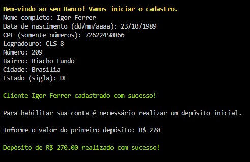
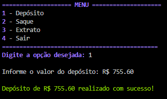
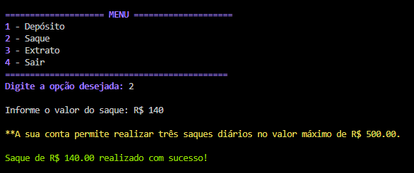
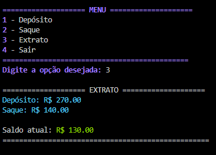
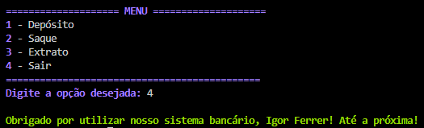

# Desafio DIO: Sistema Bancário otimizado com Python
Aprimorando o sistema bancário, a estrutura e sua eficiência, implementando a função de cliente e conta.

## Visualização: 
### Primeira versão: 
Implementação das operações de depóstico, saque e extrato aprimoradas.  

### Segunda versão:
Implementando a criação de cliente e conta.  

Operação de depósito.  

Operação de saque.  

Operação de extrato.  

Finalizando sessão.  

  Referência: [DIO-Python](https://github.com/digitalinnovationone/trilha-python-dio)
